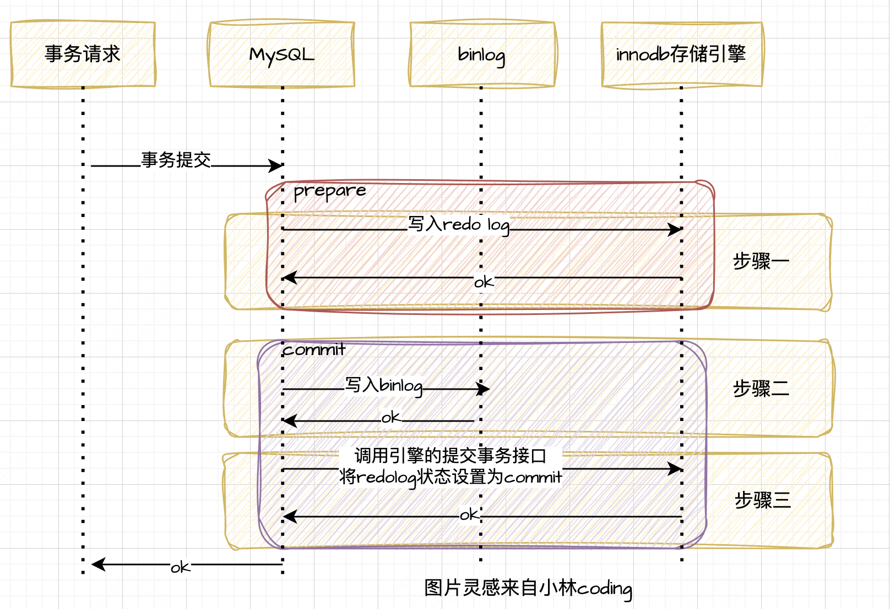

数据库是服务端开发离不开的中间件，为了提高大型项目中数据库的可用性，常常通过集群的方式部署数据库。本文将从数据库集群的技术要点出发，介绍基于 MySQL 和 Redis 的数据库集群方案。

<!--more-->

## MySQL

MySQL 最初是一种单机的数据库系统，他的集群出现主要是为了应对高并发读写和数据库宕机的场景。针对这样的场景，MySQL 采用了多个服务集群部署、读写分离等策略来应对。MySQL 集群的方式有很多种，目的都是为了提高其可用性。

### 读写分离

读写分离是提高 MySQL 并发量的一种策略，其含义是使用多个具有相同数据的 MySQL 实例来分担大量查询请求。其本质上是有一个或多个主节点作为客户端写入的实例，其他的实例作为备份节点，提供只读的服务。

读写分离本质上相当于一种请求的负载均衡，将读请求分担到多个从节点，将写请求分担到主节点。但也会面临一些集群的问题。根据经典的 CAP 理论，网络分区容忍性必须保证，那么一致性和可用性就成为一个值得权衡的点。最明显的就是由于主从同步的延迟，可能会出现数据不一致的问题。

### 集群模式

#### MySQL Replication

MySQL Replication 最基本的 MySQL 集群功能，基于一主多从的架构，主库负责写数据，从库负责读数据。主库会将数据变更记录在 binlog 中，从库通过读取主库的 binlog 来获取主库的最新数据，相当于主库的 sql 语句在从库上又执行了一遍。

#### MySQL Fabirc

MySQL Fabric 是在 MySQL Replication 的基础上，增加的故障检测与转移、自动数据分片的功能。但是依然是基于一主多从的架构，主库负责写数据，从库负责读数据。MySQL Fabric 只有一个主节点，但是当主节点挂掉以后，会从从节点中选一个来当主节点。

#### MySQL Cluster

MySQL Cluster 是一种多主多从的架构，也是由 MySQL 官方提供。他的高可用、负载均衡、伸缩性都很优秀，但是架构模式和原理很复杂，并且只能使用 NDB 存储引擎而不是 InnoDB 存储引擎（比如在事务隔离级别上只支持 Read Committed）。

### 主从同步

MySQL 的集群之间的数据同步是基于 binlog 的。binlog 是 MySQL 服务器的二进制日志，记录了对数据库的修改，包括增删改操作。通过 binlog，可以将数据同步到其他的 MySQL 服务器，实现数据库集群的数据一致性。

binlog 有三种格式，一种是 statement，一种是 row，还有一种是 mixed。statement 格式的 binlog 记录的是 SQL 语句的原始文本，row 格式的 binlog 记录的是每行数据的修改，mixed 格式的 binlog 既记录 SQL 语句，又记录每行数据的修改。

假如我们执行一个删除的 SQL，`delete from table1 where id > 100 limit 1`，由于 limit 这个命令，可能导致从库具体的这个 limit 1 和主库的 limit 1 不是同一行数据，所以造成误删的风险，那么 row 格式的 binlog 就应运而生了。但是由于每次记录 row 类型的 binlog 对内存开销太大，所以就有了 mixed 格式的 binlog——既记录 SQL 语句，又记录每行数据的修改，做了两者之间的权衡。

不同的集群模式主从同步的方式也不太一样，但大致流程相似：

1. 主库接收到客户端的更新请求，执行更新操作并写入 binlog
2. 从库在主从之间简历长连接
3. 主库的 dump_tread 从本地读取 binlog 给从库
4. 从库获取到主库的 binlog 后存储到本地，成为 relay log
5. 从库的 sql_thread 读取 relay log，解析出具体的 sql 语句，执行 sql 语句

主从库之间的数据借助 binlog 进行复制，数据复制的一般分为同步和异步两种。同步复制就是主库接收到写请求完成以后，会等待副本的写请求也完成，才返回客户端，而异步复制就是主库直接返回客户端，不等待副本的写请求完成，然后让异步线程去处理副本的写请求。很经典的问题出现了：同步复制能够很好保证数据一致性，但是性能差；异步复制反之。

其实除了我们讨论的主从复制，还有多主复制、无主复制等演化得到的不同的主从模型，此处就不在深入讨论了。

MySQL 5.7 版本引入了半同步复制。异步复制是事务线程完全不等复制响应。同步复制是事务线程要等所有复制响应。半同步复制就是等待一部分复制响应就认为成功。

比较重要的是半同步复制。

半同步复制过程中有一个参数“rpl_semi_sync_master_wait_no_slave”，默认值是 1，表示等待至少一个从库的响应，如果设置为大于 1 的值，表示等待指定数量的从库的响应。

还有一个是”rpl_semi_sync_master_wait_point“，表示的是主库提交事务之前等待复制还是提交事务之后等待复制。，默认是先等待复制（AFTER_SYNC），再提交事务，这样不会完全丢数据。相反的配置（AFTER_COMMIT）是先提交事务，再等待复制，这样会性能好一点，但是存在宕机丢数据的风险。

如果主库提交事务的线程等待复制的时间超时了，那么这种情况下 MySQL 会自动降级为异步复制模式。

一种优化方式是增强半同步复制——基于两阶段提交的优化。

[两阶段提交](https://xiaolincoding.com/mysql/log/how_update.html#%E4%B8%A4%E9%98%B6%E6%AE%B5%E6%8F%90%E4%BA%A4%E7%9A%84%E8%BF%87%E7%A8%8B%E6%98%AF%E6%80%8E%E6%A0%B7%E7%9A%84)是 MySQL 用于利用类似分布式 XA 两阶段提交（分布式一致性的一种解决方法），解决 redo log 和 binlog 一致性的一种日志提交方式。

增强半同步复制不同于普通的半同步复制，它的等待备库返回 ACK 的时间点是最后的 commit 之后（即图片中的步骤三之后）。步骤二生成 binlog 以后发给从库，从库对得到的 binlog 同步完毕以后主库进行步骤三 commit，然后认为同步完毕。
这样如果日志没有传给从库，主库也不会 commit，保障了数据同步一致性。

### 主从延迟

主从延迟指的是从主库生成 binlog 到从库接收到 binlog 然后执行完对应的事务之间的延迟。

主从延迟的原因主要有以下几点：

1. 网络延迟：主从之间网络延迟越长，主从延迟就越大。
2. 某些情况下，从库的机器性能比主库的机器性能差。
3. 从库的读压力过大
4. 慢 sql、大事务造成的时间等待，binlog 生成速度慢，导致从库延迟。

针对主从同步的延迟，有一些可靠性和可用性的策略调整，如双 M（两个主机）、半同步复制等针对主从的调度策略，会减少主从延迟。

### 分库分表

分库分表主要是为了解决两个问题：解决查询慢的问题，解决高并发的问题。

解决查询慢的问题，其实只需要减少每次查询时检索的数据量就行了。例如：即使数据量很大的情况，如果能走索引，那么查询扫描的次数也很少，并不需要全表扫描检索很多次，所以性能也很好。当然我们考虑的肯定是不全能走索引的情况，那么除了建立合适的索引之外，还可以考虑**分表**。只需要将查询的数据分散到多个表中，每次查询对应的表，这样检索的数据就变少了，查询效率也变快了。

解决高并发的问题，这就需要**分库**了。因为有时候查询的压力过大，并发量过多，一个数据库实例就容易扛不住导致宕机。通过分库的方式，就可以把并发请分散到多个实例中，从而缓解一个实例的压力。

分库分表一般垂直和水平两种，一般来讲，垂直分库分表主要是将原来一张表里面的字段拆分开，分散到多个表中，其目的是加快查询效率，减少一些不必要的字段。水平分库分表主要是为了将数据分散开，一般会选择某种哈希算法，针对表的 id 进行水平划分，起到负载均衡的作用。水平分库分表也是解决海量存储的一种策略，即使是走索引的查询，数据量少了也会减少磁盘 IO 次数，从而加快查询效率。

## Redis

像 MySQL 的同步基于 binlog 一样，Redis 的同步也是基于日志的。主要有 AOF（Append Only File）和 RDB（Redis DataBase）两种方式。AOF 是 Redis 在每行数据操作以后记录同样的操作语句，而 RDB 是内存快照。当然也各有利弊，这里不在赘述。

Redis 的集群主要有主从集群、哨兵集群、切片集群等模式，其目的都是为了保证 Redis 的高可用性。

### 主从集群

主从集群是 Redis 的一种集群模式，其原理是主节点负责写数据，从节点负责读数据。主节点将数据同步到从节点，从节点通过读取主节点的数据来获取最新的数据，类似于 MySQL 的主从集群。

主从同步主要有三个阶段：

1. 连接阶段：从库给主库发送 psync 命令表示要进行同步，里面包括的了主库的 runID 和复制进度 offset（第一次为-1）。主库收到收到以后会返回 FULLRESYNC 命令，并带上主库的 runID 和 offset。（第一次全量复制）
2.

主从集群的优点是数据复制简单，缺点是数据不一致。如果主节点挂掉，从节点只能提供只读服务。

### 哨兵集群

## 参考文献

- [多图文，详细介绍 mysql 各个集群方案](https://www.cnblogs.com/lgx211/p/12456859.html)
- [MySQL 中常见的几种高可用架构部署方案](https://www.cnblogs.com/ricklz/p/17335755.html)
- [MySQL 日志：undo log、redo log、binlog 有什么用？](https://xiaolincoding.com/mysql/log/how_update.html#%E4%B8%A4%E9%98%B6%E6%AE%B5%E6%8F%90%E4%BA%A4%E7%9A%84%E8%BF%87%E7%A8%8B%E6%98%AF%E6%80%8E%E6%A0%B7%E7%9A%84)
- [MySQL 半同步复制及半同步复制增强](https://juejin.cn/post/6981745007552102407)
