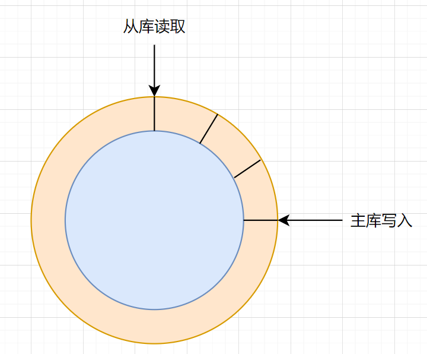

数据库是服务端开发离不开的中间件，为了提高大型项目中数据库的可用性，常常通过集群的方式部署数据库。本文将从数据库集群的技术要点出发，介绍基于 MySQL 和 Redis 的数据库集群方案。

<!--more-->

## MySQL

MySQL 最初是一种单机的数据库系统，他的集群出现主要是为了应对高并发读写和数据库宕机的场景。针对这样的场景，MySQL 采用了多个服务集群部署、读写分离等策略来应对。MySQL 集群的方式有很多种，目的都是为了提高其可用性。

### 读写分离

读写分离是提高 MySQL 并发量的一种策略，其含义是使用多个具有相同数据的 MySQL 实例来分担大量查询请求。其本质上是有一个或多个主节点作为客户端写入的实例，其他的实例作为备份节点，提供只读的服务。

读写分离本质上相当于一种请求的负载均衡，将读请求分担到多个从节点，将写请求分担到主节点。但也会面临一些集群的问题。根据经典的 CAP 理论，网络分区容忍性必须保证，那么一致性和可用性就成为一个值得权衡的点。最明显的就是由于主从同步的延迟，可能会出现数据不一致的问题。

### 集群模式

#### MySQL Replication

MySQL Replication 最基本的 MySQL 集群功能，基于一主多从的架构，主库负责写数据，从库负责读数据。主库会将数据变更记录在 binlog 中，从库通过读取主库的 binlog 来获取主库的最新数据，相当于主库的 sql 语句在从库上又执行了一遍。

#### MySQL Fabirc

MySQL Fabric 是在 MySQL Replication 的基础上，增加的故障检测与转移、自动数据分片的功能。但是依然是基于一主多从的架构，主库负责写数据，从库负责读数据。MySQL Fabric 只有一个主节点，但是当主节点挂掉以后，会从从节点中选一个来当主节点。

#### MySQL Cluster

MySQL Cluster 是一种多主多从的架构，也是由 MySQL 官方提供。他的高可用、负载均衡、伸缩性都很优秀，但是架构模式和原理很复杂，并且只能使用 NDB 存储引擎而不是 InnoDB 存储引擎（比如在事务隔离级别上只支持 Read Committed）。

### 主从同步

MySQL 的集群之间的数据同步是基于 binlog 的。binlog 是 MySQL 服务器的二进制日志，记录了对数据库的修改，包括增删改操作。通过 binlog，可以将数据同步到其他的 MySQL 服务器，实现数据库集群的数据一致性。

binlog 有三种格式，一种是 statement，一种是 row，还有一种是 mixed。statement 格式的 binlog 记录的是 SQL 语句的原始文本，row 格式的 binlog 记录的是每行数据的修改，mixed 格式的 binlog 既记录 SQL 语句，又记录每行数据的修改。

假如我们执行一个删除的 SQL，`delete from table1 where id > 100 limit 1`，由于 limit 这个命令，可能导致从库具体的这个 limit 1 和主库的 limit 1 不是同一行数据，所以造成误删的风险，那么 row 格式的 binlog 就应运而生了。但是由于每次记录 row 类型的 binlog 对内存开销太大，所以就有了 mixed 格式的 binlog——既记录 SQL 语句，又记录每行数据的修改，做了两者之间的权衡。

不同的集群模式主从同步的方式也不太一样，但大致流程相似：

1. 主库接收到客户端的更新请求，执行更新操作并写入 binlog
2. 从库在主从之间简历长连接
3. 主库的 dump_tread 从本地读取 binlog 给从库
4. 从库获取到主库的 binlog 后存储到本地，成为 relay log
5. 从库的 sql_thread 读取 relay log，解析出具体的 sql 语句，执行 sql 语句

主从库之间的数据借助 binlog 进行复制，数据复制的一般分为同步和异步两种。同步复制就是主库接收到写请求完成以后，会等待副本的写请求也完成，才返回客户端，而异步复制就是主库直接返回客户端，不等待副本的写请求完成，然后让异步线程去处理副本的写请求。很经典的问题出现了：同步复制能够很好保证数据一致性，但是性能差；异步复制反之。

其实除了我们讨论的主从复制，还有多主复制、无主复制等演化得到的不同的主从模型，此处就不在深入讨论了。

MySQL 5.7 版本引入了半同步复制。异步复制是事务线程完全不等复制响应。同步复制是事务线程要等所有复制响应。半同步复制就是等待一部分复制响应就认为成功。

比较重要的是半同步复制。

半同步复制过程中有一个参数“rpl_semi_sync_master_wait_no_slave”，默认值是 1，表示等待至少一个从库的响应，如果设置为大于 1 的值，表示等待指定数量的从库的响应。

还有一个是”rpl_semi_sync_master_wait_point“，表示的是主库提交事务之前等待复制还是提交事务之后等待复制。，默认是先等待复制（AFTER_SYNC），再提交事务，这样不会完全丢数据。相反的配置（AFTER_COMMIT）是先提交事务，再等待复制，这样会性能好一点，但是存在宕机丢数据的风险。

如果主库提交事务的线程等待复制的时间超时了，那么这种情况下 MySQL 会自动降级为异步复制模式。

一种优化方式是增强半同步复制——基于两阶段提交的优化。

[两阶段提交](https://xiaolincoding.com/mysql/log/how_update.html#%E4%B8%A4%E9%98%B6%E6%AE%B5%E6%8F%90%E4%BA%A4%E7%9A%84%E8%BF%87%E7%A8%8B%E6%98%AF%E6%80%8E%E6%A0%B7%E7%9A%84)是 MySQL 用于利用类似分布式 XA 两阶段提交（分布式一致性的一种解决方法），解决 redo log 和 binlog 一致性的一种日志提交方式。

增强半同步复制不同于普通的半同步复制，它的等待备库返回 ACK 的时间点是最后的 commit 之后（即图片中的步骤三之后）。步骤二生成 binlog 以后发给从库，从库对得到的 binlog 同步完毕以后主库进行步骤三 commit，然后认为同步完毕。
这样如果日志没有传给从库，主库也不会 commit，保障了数据同步一致性。

### 主从延迟

主从延迟指的是从主库生成 binlog 到从库接收到 binlog 然后执行完对应的事务之间的延迟。

主从延迟的原因主要有以下几点：

1. 网络延迟：主从之间网络延迟越长，主从延迟就越大。
2. 某些情况下，从库的机器性能比主库的机器性能差。
3. 从库的读压力过大
4. 慢 sql、大事务造成的时间等待，binlog 生成速度慢，导致从库延迟。

针对主从同步的延迟，有一些可靠性和可用性的策略调整，如双 M（两个主机）、半同步复制等针对主从的调度策略，会减少主从延迟。

### 分库分表

分库分表主要是为了解决两个问题：解决查询慢的问题，解决高并发的问题。

解决查询慢的问题，其实只需要减少每次查询时检索的数据量就行了。例如：即使数据量很大的情况，如果能走索引，那么查询扫描的次数也很少，并不需要全表扫描检索很多次，所以性能也很好。当然我们考虑的肯定是不全能走索引的情况，那么除了建立合适的索引之外，还可以考虑**分表**。只需要将查询的数据分散到多个表中，每次查询对应的表，这样检索的数据就变少了，查询效率也变快了。

解决高并发的问题，这就需要**分库**了。因为有时候查询的压力过大，并发量过多，一个数据库实例就容易扛不住导致宕机。通过分库的方式，就可以把并发请分散到多个实例中，从而缓解一个实例的压力。

分库分表一般垂直和水平两种，一般来讲，垂直分库分表主要是将原来一张表里面的字段拆分开，分散到多个表中，其目的是加快查询效率，减少一些不必要的字段。水平分库分表主要是为了将数据分散开，一般会选择某种哈希算法，针对表的 id 进行水平划分，起到负载均衡的作用。水平分库分表也是解决海量存储的一种策略，即使是走索引的查询，数据量少了也会减少磁盘 IO 次数，从而加快查询效率。

## Redis

像 MySQL 的同步基于 binlog 一样，Redis 的同步也是基于日志的。主要有 AOF（Append Only File）和 RDB（Redis DataBase）两种方式。AOF 是 Redis 在每行数据操作以后记录同样的操作语句，而 RDB 是内存快照。当然也各有利弊，这里不在赘述。

Redis 的集群主要有主从集群、哨兵集群、切片集群等模式，其目的都是为了保证 Redis 的高可用性。

### 主从集群

主从集群是 Redis 的一种集群模式，其原理是主节点负责写数据，从节点负责读数据。主节点将数据同步到从节点，从节点通过读取主节点的数据来获取最新的数据，类似于 MySQL 的主从集群。

主从同步主要有三个阶段：

1. 连接阶段：从库给主库发送 psync 命令表示要进行同步，里面包括的了主库的 runID 和复制进度 offset（第一次为-1）。主库收到收到以后会返回 FULLRESYNC 命令，并带上主库的 runID 和 offset。（第一次全量复制）
2. 发送 RDB：主库执行 bgsave 命令生成 RDB 文件并发送给从库，从库接收到以后清空当前数据库，然后加载 RDB 文件。由于 bgsave 是后台复制一个子进程，复制了操作系统的页表，所以不会阻塞当前进程，主库当前仍然可以接受读写请求。但是在同步过程中的写入操作并不会即时写入 RDB 文件，而是会写入 replication buffer，在 RDB 发送完成以后发送给从库。
3. 发送 replication buffer：主库将 replication buffer 中的数据发送给从库，从库接收到以后写入磁盘。

有时候为了减轻主库的压力，会采用主-从-从的多级复制模式，并且主库和从库直接回维持一个长连接，从而减少时间开销，尽可能减少同步数据的不一致性，但这样同样会面临网络不稳定的问题。针对网络不稳定的问题，Redis 还有一种应对的策略，就是增量复制。

增量同步通过 repl_backlog_buffer 这个环形的数据结构实现（有点像 redolog 的写入缓冲区），其中主库在前面写，从库在后面读，前后像是一种追赶的关系。理想情况下，两者是同时进行的关系，也就是说时时刻刻他们俩的指针都在同一位置。但事实上他们之间会有差距，所以当网络突然断掉，从库在向主库发送 psync 命令，表示要建立链接的时候，就会将自己的在 repl_backlog_buffer 中读到哪个位置的数据发给主库，那么接下来主库只需要发送对应位置之后的数据就可以了，不用全量发送，从而实现了增量发送的目的。

但是由于这个缓冲区本身是一个环形的设计，所以有可能会发生主库写入数据覆盖了之前的数据，但是从库还没有读取这个数据的情况。我猜想这个数据结构设计本意是为了减少空间使用且不用使用数据淘汰策略（覆盖写入自动淘汰），减少时间空间开销，但是也引出了这种问题。我们只能认为通过增大这个缓冲区的大小减少这个事情发生的可能性。

### 哨兵集群

为了保证 Redis 的高可用性，我们需要考虑主库也可能宕机的情况。但是主库宕机也很复杂，我们需要判断主库真的挂了吗？选哪个当从库？新的主库怎么和其他从库链接呢？由此引入哨兵机制，帮助选主并与其他从库同步。

哨兵在此处的作用类似于注册中心，他的主要作用是监控、选主、通知，其本身也是一个 Redis 实例。

1. 监控：哨兵会不断向主库和从库发送 Ping 命令，如果一段时间没有回复，那么就认为主观下线。
2. 选主：哨兵会对从库直接进行判断，选择最优的一个作为主库。主要是考虑优先级（用户配置），复制进度（之前提到的增量复制的进度），和 RedisID 决定。
3. 通知：哨兵会将选出的主库信息发送 replicaof 命令给其他从库，其他从库会更新自己的主库信息。

实际上，哨兵本身也是集群部署，在判断 Redis 实例存活/宕机时，会采用投票机制（少数服从多数）来判断数据库是否客观下线。

哨兵集群中真正执行将从库升级为主库的节点叫 Leader 节点，这个节点也是由其他哨兵实例投票选举+大于用户配置的参数决定。

哨兵模式可能会出现脑裂的问题。脑裂就是一个大脑裂开成两个，对应到 Redis 集群中就是出现了两个主节点。节点 A 一开始是主节点，由于网络抖动被认为下线了，于是哨兵集群选举了一个新节点 B 作为主节点。一段时间以后节点 A 复活了，集群会把 A 降级为从节点。既然是从节点，就需要与主节点 B 同步数据。由于 A 作为从节点，B 作为主节点，他们是第一次同步数据，所以 A 会清空自己的数据，将 B 的 RDB 完全读入。但是由于 B 是被选出来的新主节点，他里面的数据和之前的 A 并不是完全相同（他们之间的同步不是强一致性，是最终一致性），所以在 A 作为主节点的时候，有些数据 A 里面有，B 里面没有。那么 A 作为从节点的时候，清空了自己的数据，那么就可能会造成数据丢失。

在 Redis 中有两个配置的属性：

1. min-slaves-to-write x，主节点必须要有至少 x 个从节点连接，如果小于这个数，主节点会禁止写数据。
2. min-slaves-max-lag x，主从数据复制和同步的延迟不能超过 x 秒，如果超过，主节点会禁止写数据。

实际上这种配置本质上是限制了节点 A 的读写，只允许了新主库 B 的读写，从时间角度上减少了脑裂的可能性。

### 切片集群

切片集群类似于 MySQL 的分库分表，将数据切分到多个 Redis 实例中，从而实现数据横向扩展。官方提供了一个 Redis Cluster 方案，用来实现切片集群。

Redis Cluster 方案采用 Hash Slot 来处理数据和实例之间的映射关系，一个切片集群由 16384 个哈希槽。首先根据键值对的 key 根据 CRC16 算法计算一个 16bit 的值，然后用这个 16 位的值对 16384 取模，得到映射对应的哈希槽位。Redis Cluster 会把这一万多个哈希槽均匀地分布到多个节点上，每个节点负责一部分哈希槽。

在客户端访问时，会根据算法算出 key 对应的哈希槽位，然后直接访问对应的节点，就好像这个分片的操作对于客户端来说是完全无感的

## 参考文献

- [多图文，详细介绍 mysql 各个集群方案](https://www.cnblogs.com/lgx211/p/12456859.html)
- [MySQL 中常见的几种高可用架构部署方案](https://www.cnblogs.com/ricklz/p/17335755.html)
- [MySQL 日志：undo log、redo log、binlog 有什么用？](https://xiaolincoding.com/mysql/log/how_update.html#%E4%B8%A4%E9%98%B6%E6%AE%B5%E6%8F%90%E4%BA%A4%E7%9A%84%E8%BF%87%E7%A8%8B%E6%98%AF%E6%80%8E%E6%A0%B7%E7%9A%84)
- [MySQL 半同步复制及半同步复制增强](https://juejin.cn/post/6981745007552102407)
- [06 | 数据同步：主从库如何实现数据一致？](https://time.geekbang.org/column/article/272852)
- [07 | 哨兵机制：主库挂了，如何不间断服务？](https://time.geekbang.org/column/article/274483)
- [08 | 哨兵集群：哨兵挂了，主从库还能切换吗？](https://freegeektime.com/100056701/275337/)
- [小林 coding | Redis 常见面试题](https://xiaolincoding.com/redis/base/redis_interview.html#%E9%9B%86%E7%BE%A4%E8%84%91%E8%A3%82%E5%AF%BC%E8%87%B4%E6%95%B0%E6%8D%AE%E4%B8%A2%E5%A4%B1%E6%80%8E%E4%B9%88%E5%8A%9E)
