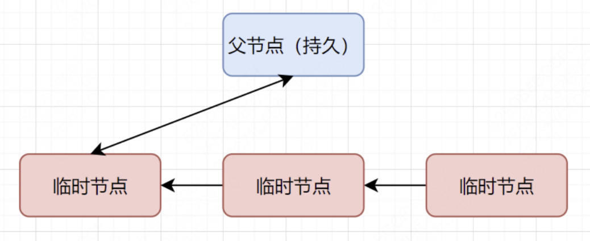
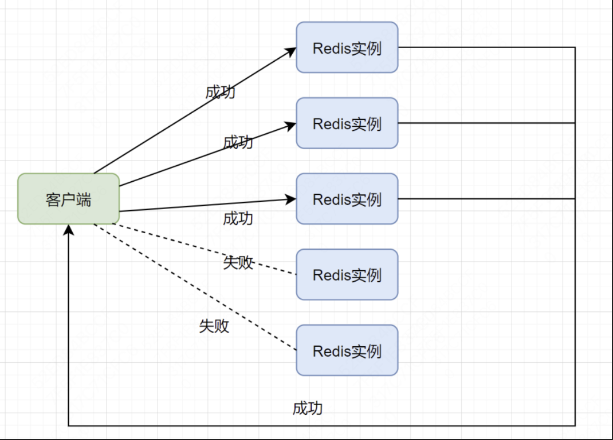

分布式锁是一种常用的技术，在高并发场景下，为了避免多个进程或线程同时操作同一资源造成冲突，引入分布式锁机制。本文将介绍分布式锁的原理和使用场景，并通过 Redis、Zookeeper、Redisson 等中间件来实现分布式锁。

<!--more-->

## 分布式锁的主要特性

- 互斥：不同线程之间互斥，只有一个线程能持有锁。
- 超时机制：代码耗时过长，网络原因等，导致锁一直被占用，造成死锁，所以引入超时机制，超过指定时间自动释放锁。
- 可重入性：当前请求的节点 + 线程唯一标识，可以再次获取同一把锁
- 公平性：锁唤醒时候，按照顺序唤醒，不公平的话，有可能出现饥饿现象。

## 分布式锁的原理与实现

分布式锁的目的是区别于 JVM 单机锁。

JVM 单机锁就是在同一个 JVM 中的锁。比如你使用了 synchronized 关键字，那么就是在这同一个 JVM 中，同一时刻只能有一个线程持有锁，其他线程只能等待。但是当你的后端服务式多个机器的集群部署方式，那么 JVM 单机锁就无法满足需求了。因为你这个 JVM 锁住了，我的线程打到了另一台机器上，那就相当于没锁住，所以我们需要分布式锁。分布式锁的目的就是在多个 JVM 层之前设置的锁，这样就可以在多个机器上实现同一把锁的目的。


分布式锁的原理就是在多个机器上设置同一把锁，这个锁通常通过某些中间件实现。当一个线程想要获取锁的时候，首先会去尝试获取锁，如果获取成功，那么就可以执行任务，如果获取失败，那么就只能等待，直到锁被释放。

### MySQL

#### 基于索引

基于索引的实现，是通过在数据库的某个字段上加了唯一的索引，那么只有一个线程能够对写入同一个数据，其他的线程由于索引的唯一性而无法写入，只能等待资源释放——这个唯一值被 DELETE 掉，那么可以重新写入来获取锁

我们可以先创建一个类似的表：

```sql
CREATE TABLE `database_lock` (
 `id` BIGINT NOT NULL AUTO_INCREMENT,
 `resource` int NOT NULL COMMENT '锁定的资源',
 `description` varchar(1024) NOT NULL DEFAULT "" COMMENT '描述',
 PRIMARY KEY (`id`),
 UNIQUE KEY `uiq_idx_resource` (`resource`)
) ENGINE=InnoDB DEFAULT CHARSET=utf8mb4 COMMENT='数据库分布式锁表';

```

其中的 resource 就是锁的名字，locked_at 就是锁的创建时间。

这里我们给数据库加了一个唯一索引，目的是对资源进唯一性约束。这样在写入同一个数据时，只能有一个线程写入，其他线程只能失败。通过这样的方法就实现了一个分布式锁。

这种锁的实现比较简单，但也会面临锁无法过期，锁的可靠性依赖于 MySQL 数据库的可用性等等问题。

#### 基于乐观锁

基于乐观锁的实现原理是多个线程可以同时对资源进行修改，但最终只能有一个修改成功，其他的回退。乐观锁的实现一般是基于版本号的机制，比如在更新数据时，先获取当前版本号，然后更新数据，再更新版本号。如果更新失败，说明数据已经被其他线程更新过了，那么就需要重试。

例如建立如下的数据库表：

```sql
CREATE TABLE `optimistic_lock` (
 `id` BIGINT NOT NULL AUTO_INCREMENT,
 `resource` int NOT NULL COMMENT '锁定的资源',
 `version` int NOT NULL COMMENT '版本信息',
 `created_at` datetime COMMENT '创建时间',
 `updated_at` datetime COMMENT '更新时间',
 `deleted_at` datetime COMMENT '删除时间',
 PRIMARY KEY (`id`),
 UNIQUE KEY `uiq_idx_resource` (`resource`)
) ENGINE=InnoDB DEFAULT CHARSET=utf8mb4 COMMENT='数据库分布式锁表';
```

每个线程的执行逻辑如下：

- 获取资源： SELECT resource, version FROM optimistic_lock WHERE id = 1
- 执行业务逻辑
- 更新资源：UPDATE optimistic_lock SET resource = resource -1, version = version + 1 WHERE id = 1 AND version = oldVersion

通过比对修改后的 version 和修改之前的 oldVersion，如果一致，说明数据没有被其他线程更新过，那么就更新成功，否则就需要重试。

这种锁的实现比较复杂，但也能保证数据的一致性。在检测数据冲突时并不依赖数据库本身的锁机制，不会影响请求的性能。但是需要对表的设计增加额外的字段，增加了数据库的冗余。并且高并发的情况下增加了重试的次数，会影响性能。

#### 基于悲观锁

基于悲观锁的实现原理是多个线程只能一个一个地获取锁，直到获取锁的线程释放锁，其他线程才能获取锁。我们在基于 MySQL 的悲观锁的实现中，一般采用 MySQL 自带的锁机制，比如 SELECT ... FOR UPDATE。数据库会在查询的过程中加上排他锁，那么这样别的事务就无法对该资源进行修改。

基于悲观锁的实现过程如下：

- 获取资源： SELECT \* FROM optimistic_lock WHERE id = 1 FOR UPDATE
- 执行业务逻辑
- 释放资源：COMMIT

相当于我们基于 SELECT ... FOR UPDATE 获取了这行数据的锁，并且在同一事务下执行修改的业务逻辑，最终在 COMMIT 提交事务时释放锁。

这种锁的的实现也比较简单，主要是基于数据库的事务和行锁。但要注意行锁失效的情况。并且每次请求都会额外产生加锁的开销且未获取到锁的请求将会阻塞等待锁的获取，在高并发环境下，容易造成大量请求阻塞，影响系统可用性。

### Zookeeper

基于 Zookeeper 的分布式锁，主要来自于 Zookeeper 的两个机制

- 临时顺序节点机制

Zookeeper 的节点是一个类似于文件系统的目录结构，每个节点都可以设置临时顺序节点，也就是说，在创建节点时，可以指定一个顺序，然后 Zookeeper 会根据这个顺序来分配节点的唯一标识符。除此以外节点也可以被标记为持久节点，持久节点会一直存在直到主动删除。

- watch 机制

Zookeeper 的 watch 机制允许用户在指定的节点上注册一个监听器，当节点发生变化时，Zookeeper 会通知监听器，并触发监听器的回调函数。

基于这两个机制，我们可以实现一个基于 Zookeeper 的分布式锁。

我们首先建立一个父节点，这个父节点是一个持久节点，用来表示共享资源。然后在父节点下创建临时顺序节点，这个临时顺序节点用来标识当前获得锁的线程。最终在父节点之下建立了一个类似于队列的结构。然后判断当前节点是不是最小的节点，如果是最小的节点，那么就获取锁，否则就监听前一个节点的删除事件，直到获得锁。每次节点使用完共享资源，就会删除该节点，进而释放锁，后面的节点通过 watch 监听前一个节点的删除事件，获得锁。



Zookeeper 实现分布式锁的好处就是可以实现顺序的公平锁。并且可以实现较强一致性，所有的操作都可以被保证是原子性的。假如某个节点宕机了，那么会自动释放锁，防止了死锁，提高了系统的可用性。

但是坏处就是，节点的创建和销毁对性能开销比较大，在高并发的环境下可能有较大的性能问题。另外，Zookeeper 的 watch 机制也会增加系统的复杂度，需要考虑节点的删除和创建的时机，以及节点的连接状态等。

### Redis

用 Redis 实现分布式锁，利用的是 SETNX+EXPIRE 命令。

SETNX 命令的作用是设置一个 key，当 key 不存在时，返回 1，如果 key 已经存在，返回 0。EXPIRE 命令的作用是设置一个 key 的过期时间，当 key 过期时，Redis 会自动删除该 key。

一般这两条命令写在一行来确保指令的原子性，如：

```redis
SETNX lock_key some_unique_value EXPIRE lock_key 10  # 设置过期时间为10秒
```

其中 lock_key 是锁的名字，some_unique_value 是唯一的值，10 是过期时间。

当两个线程同时执行这个命令时，只有一个线程会成功对 lock_key 的值进行修改，其他线程会失败，这样就达到了分布式锁的目的。

基于 Redis 实现分布式锁，由于是对值的修改，性能比较高。但是如果是在 Redis 集群环境下，由于 Redis 集群同步是异步的。如果在 Master 节点上设置锁，Slave 节点可能没有同步到最新的数据。此时 Master 节点崩溃了但是理论上锁不应当被释放，但由于 Master 的宕机导致了锁物理上被释放，所以其他客户端可能会加新的锁来对共享资源进行修改，这样就出现了问题。

解决这个问题的方法就是 RedLock 算法——也就是 Redisson 的实现原理。

### Redisson

用 Redisson 实现分布式锁，本质上是封装了 Reids 的操作来实现的。

Redisson 的公平锁的实现原理类似于 ReentrankLock 的公平锁机制，主要维护一个等待队列，通过控制锁的获取顺序来实现。

Redisson 的看门狗机制目的是检查锁的状态，自动管理分布式锁过期时间。其实现主要通过一个后台线程（俗称看门狗），每隔锁的 1/3 时间检查锁的状态，只要持有锁的线程仍在执行且没有主动释放锁，看门狗就会持续进行续期操作。如果没有线程持有锁，看门狗就会自动释放锁。


Redisson 通过 RedLock 算法，保证了集群环境中锁的可靠性。

RedLock 算法的主要目的是为了解决 Master 节点宕机导致锁的释放问题。RedLock 算法的基本思路是，在多个 Redis 节点上同时加锁，只要大多数 Redis 节点都加锁成功，那么加锁成功；如果加锁失败，则释放所有锁并重试。

RedLock 算法的流程如下：

1. 客户端获取当前时间戳。
2. 客户端在每个 Redis 节点上尝试用相同的锁名和 UUID 获取锁，并设置一个较短的过期时间。获取成功则记录加锁节点，否则记录失败节点。并记录加锁的总用时。
3. 如果成功加锁的节点大于等于 N/2+1（N 为 Redis 节点数），并且获取锁的总时间小于锁的过期时间，则认为加锁成功并执行业务逻辑；否则认为获取锁失败，释放所有锁



Redisson 通过唯一标识与计数器实现了锁的可重入的特性：

1. 每个锁在 Redis 中存储为一个键，键的值是一个唯一标识符（通常是 UUID）和一个计数器。当一个线程第一次获取锁时，Redisson 会在 Redis 中创建一个键，值为当前线程的唯一标识符，并将计数器设置为 1。
2. 如果同一个线程再次请求获取同一个锁，Redisson 会检测到该线程已经持有锁，因为 Redis 中的值包含该线程的唯一标识符。此时，Redisson 只会增加计数器，而不会再次申请锁。
3. 当线程释放锁时，Redisson 会减少计数器。只有当计数器减少到 0 时，锁才会真正被释放，Redis 中的键才会被删除。

## 分布式锁的选用

### 基于数据库

基于数据库的锁，主要是基于数据库的特性：唯一索引、乐观锁版本号自行比对，悲观锁 SELECT ... FOR UPDATE（数据库层面的锁）等。但也有很多问题，所以实际生产环境很少考虑用这把锁。

**缺点：**

1. 性能问题：数据库的锁基于磁盘数据的 CRUD 操作，必然会造成性能问题。
2. 可靠性问题：基于数据库的锁，如果数据库宕机，锁也会被释放，导致数据不一致。可以通过集群部署的方式来提高可靠性。
3. 过期问题：数据库的数据无法自动过期，如果锁一直没有释放，会造成死锁。只能通过自行配置定时任务来清理过期锁。
4. 重入问题：基于数据库的锁，如果同一个线程再次请求获取同一个锁，数据库会检测到该线程已经持有锁，但是不会再次申请锁，所以无法实现重入。可以通过人为模拟其他重入锁的实现方式（记录唯一 ID，下次访问让这个 ID 对应的计数器值加一，释放锁时让这个 ID 对应的计数器值减一），来实现重入锁。

### 基于 Zookeeper

基于 Zookeeper 的锁，主要是基于 Zookeeper 的特性：临时顺序节点、watch 机制等。Zookeeper 本身的集群设计就是为了保证强一致性，所以基于 Zookeeper 的锁可以实现较强的一致性。

**优点：**

1. 公平性：由于临时顺序节点的机制，Zookeeper 实现的分布式锁天然保证了锁的公平性。
2. 可重入性：Zookeeper 通过会话 ID 来判断是不是同一个线程访问，所以天然也实现了可重入性。
3. 锁释放问题：节点释放锁以后会自动被 Zookeeper 删除这个节点，不会出现锁释放导致的问题。

**缺点：**

1. 性能问题：由于关于锁的获取需要节点的创建和释放，并且在集群环境中只能由 Leader 节点来进行操作，所以性能会受到影响。
2. 其实 Zookeeper 也会有并发问题，在网络抖动的环境下，客户端有时候会突然连不上 Zookeeper，所以锁会被释放供后面的线程获取。但是因为 ZK 有重试机制，所以这种情况很少发生。

### 基于 redisson

基于 Redisson 的锁，主要是基于 Redisson 的特性：RedLock 算法、可重入锁等。Redisson 实现了分布式锁的功能，并且提供了一些高级功能，比如：可重入锁、过期锁自动续期、分布式锁监听器等。

**优点：**

### 参考文献

[基于 MySQL 实现的分布式锁](https://blog.csdn.net/u013474436/article/details/104924782)

[【MySQL】优雅的使用 MySQL 实现分布式锁](https://blog.csdn.net/weixin_45683778/article/details/144564485)

[Zookeeper 实现分布式锁（Zk 分布式锁）](https://blog.csdn.net/Fireworkit/article/details/136968331)

[阿里技术-分布式锁实现原理与最佳实践](https://mp.weixin.qq.com/s/hvTx6_WSZ82ok3na7L1IiA)
