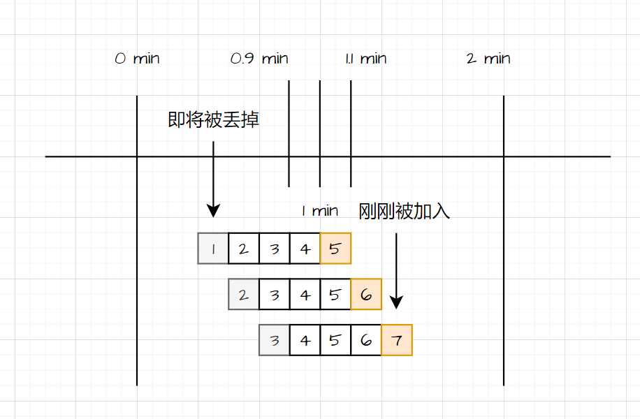
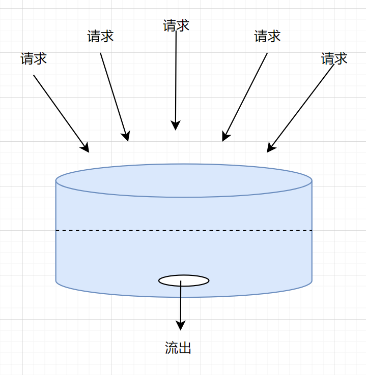
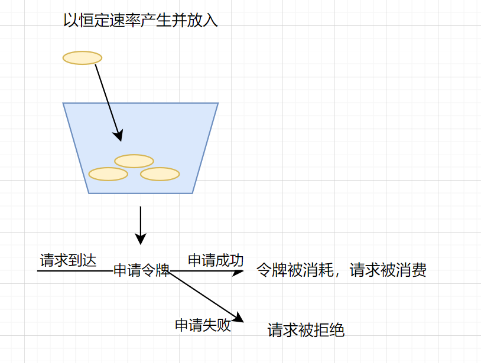

在服务端开发中，限流（Rate Limiting）是一种常见的技术，用于控制请求的流量，防止请求过多导致服务器压力过大或响应时间过长。限流算法有很多种，本文将介绍主要的几种常见限流算法及限流器设计。

<!--more-->

## 限流场景

在实际开发过程中，我们需要考虑一些需要限流的场景。比如防止突发流量激增导致服务崩溃，或者防止恶意请求导致服务器资源占用过多，又或者某些业务场景下我们需要限制用户的请求频率。

衡量请求频率的指标主要有两种：

TPS: 每秒事务数（Transaction Per Second）

TPS 代表每秒事务数，是衡量系统处理能力的一个指标。事务通常指的是一组操作的集合，可能包括多个数据库操作、消息队列处理等。在许多情况下，TPS 用于衡量数据库系统或应用程序在特定负载下的性能。

QPS: 每秒查询数（Query Per Second）

QPS 代表每秒查询数，是衡量系统查询能力的一个指标。查询通常指的是数据库查询操作，包括 SELECT、INSERT、UPDATE、DELETE 等。在许多情况下，QPS 用于衡量数据库系统或应用程序的查询性能。

在某些系统中，一个事务可能包含多个查询，因此在这些情况下，TPS 和 QPS 之间可以有一定的关系。例如，一个事务包含三个查询，那么在理想情况下，QPS 可能是 TPS 的三倍。

## 限流算法

### 基于计数器的限流

基于计数器的限流算法理解起来很容易。我们只需要维护一个计数器，然后每一分钟的开始重置计数器为 0，然后在这一分钟内如果计数器超过了某个阈值，那么对于超出阈值的请求直接拒绝，这样就实现了基于计数器的限流。


实现这样的限流很简单，但是问题也很明显：有时候请求可能会在前一秒的末尾和后一秒的开始突然出现某个阈值的流量，而根据我们队限流算法的设计，这样的请求是被允许的。但是这样的话对于 0.9s 到 1.1s 之间的流量就超过了我们设定的阈值，这样导致的瞬时流量也会对服务造成压力。所以有了滑动窗口算法。


### 基于滑动窗口的限流

基于滑动窗口的限流算法是基于计数器的限流算法的改进。它将限流的时间窗口分为多个小窗口，然后在每个小窗口内独立维护一个计数器，当计数器超过了某个阈值，那么对于超出阈值的请求直接拒绝。随着时间的推移，每次都会排除掉过去最近的一个小窗口，然后引入最新的一个小窗口。相比于基于计数器的限流，基于滑动窗口的限流算法每次推移的单位是一个小窗口区间，而不是一个大时间区间，这样就实现了更精确的时间片限流。



但是即是通过滑动窗口算法人为将时间分成了比较小的片，也依然有可能在时间区间内发生突发且不均匀的流量，可能压垮服务。但是如果小将片划分的足够小，又可能会带来系统的损耗和性能的问题。

### 漏桶算法

漏桶算法的实现原理类似于缓冲。不管请求是怎么来的，都直接放到桶里面。然后桶里面的请求以固定的速度流出。如果流量过多或者过大超出了桶的容量，那么就丢弃一些请求，桶里面的请求以固定的速度流出。



最常见的模拟漏桶算法的方式就是 FIFO 的消息队列。请求会被放到队列中，等待被服务消费。

漏桶算法可以实现流量的平滑处理，但是如果突然来了很多流量，那么桶一下就被填满了。由于流出的速率是恒定的，所以当短时间有大量的突发请求到了桶里面，那么每个请求也得等一段时间才能被相应。所以漏桶算法无法应对突发流量。

### 令牌桶算法

相较于漏桶算法，令牌桶算法可以更好的处理突发流量。每到一个请求，必须先去令牌桶里面申请令牌。申请到的令牌才会被服务器处理，否则就会拒绝。



在请求较低的时候，令牌数量会被慢慢增加，一直到达到桶的最大容量。在遇到突发流量时，令牌桶内会有一定的令牌数。新到达的请求会申请这些令牌且不会被拒绝，这样就有了当面对突发流量时的应对能力。

令牌桶算法当然可以基于队列实现，这样比较直观。我们也可以直接用时间的方式去实现，这样就不用在内存中维护队列了。

两个简单的获取令牌的实现示例：

```java
import java.util.concurrent.atomic.AtomicInteger;
import java.util.concurrent.Executors;
import java.util.concurrent.ScheduledExecutorService;
import java.util.concurrent.TimeUnit;

public class TokenBucketRateLimiter {
    private final int bucketCapacity; // 令牌桶的容量
    private final int refillRate; // 令牌生成速率（每秒生成的令牌数）
    private AtomicInteger tokens; // 当前令牌数

    public TokenBucketRateLimiter(int bucketCapacity, int refillRate) {
        this.bucketCapacity = bucketCapacity;
        this.refillRate = refillRate;
        this.tokens = new AtomicInteger(0);
        startRefilling(); // 启动定期生成令牌的线程
    }

    // 尝试获取一个令牌
    public boolean tryAcquire() {
        int currentTokens = tokens.get();
        if (currentTokens > 0) {
            if (tokens.compareAndSet(currentTokens, currentTokens - 1)) {
                System.out.println("请求获得令牌，允许通过");
                return true;
            }
        }
        System.out.println("请求被拒绝：无可用令牌");
        return false;
    }

    // 定期为令牌桶添加令牌
    private void startRefilling() {
        ScheduledExecutorService executor = Executors.newScheduledThreadPool(1);
        executor.scheduleAtFixedRate(() -> {
            int currentTokens = tokens.get();
            if (currentTokens < bucketCapacity) {
                int newTokens = Math.min(bucketCapacity, currentTokens + refillRate);
                tokens.set(newTokens);
                System.out.println("新增令牌，当前令牌数：" + newTokens);
            }
        }, 0, 1, TimeUnit.SECONDS); // 每秒填充令牌
    }

    public static void main(String[] args) {
        TokenBucketRateLimiter rateLimiter = new TokenBucketRateLimiter(10, 2); // 容量为10，每秒生成2个令牌

        // 模拟10个请求
        for (int i = 0; i < 10; i++) {
            boolean allowed = rateLimiter.tryAcquire();
            if (!allowed) {
                System.out.println("请求 " + i + " 被拒绝");
            }
            try {
                Thread.sleep(200); // 模拟请求间隔
            } catch (InterruptedException e) {
                Thread.currentThread().interrupt();
            }
        }
    }
}
```

```go
package ratelimit

import (
  "fmt"
  "sync"
  "time"
 )

 type RateLimiter struct {
  rate   int64 // 令牌放入速度
  max    int64 // 令牌最大数量
  last   int64 // 上一次请求发生时间
  amount int64 // 令牌数量
  lock   sync.Mutex // 由于读写冲突，需要加锁
 }

    // 获得当前时间
 func cur() int64 {
  return time.Now().Unix()
 }

 func New(rate int64, max int64) *RateLimiter {
  // TODO: 检查一下rate和max是否合法
  return &RateLimiter{
   rate:   rate,
   max:    max,
   last:   cur(),
   amount: max,
  }
 }

 func (rl *RateLimiter) Pass() bool {
  rl.lock.Lock()
  defer rl.lock.Unlock()

        // 距离上一次请求过去的时间
  passed := cur() - rl.last
  fmt.Println("passed is: ", passed)

        // 计算在这段时间里 令牌数量可以增加多少
  amount := rl.amount + passed*rl.rate

        // 如果令牌数量超过上限；我们就不继续放入那么多令牌了
  if amount > rl.max {
   amount = rl.max
  }

        // 如果令牌数量仍然小于0，则说明请求应该拒绝
  if amount <= 0 {
   return false
  }

        // 请求被放行则令牌数-1
  amount--
  rl.amount = amount
        // 更新上次请求时间
  rl.last = cur()

  return true
 }
```

## 限流器设计

如果我们要设计一个限流器，通常要考虑下面几个方面资源的限流：

1. 全局接口限流
2. 用户的账号限流
3. 某请求限流
4. 设备限流

限流器通常位于网关的部分，属于网关的一个过滤器，通过责任链模式进行校验后转发到后端服务。

限流的模式有本地限流和远程限流两种：本地限流和远程限流。

本地限流就是每个网关服务器自身进行限流。网关直接亦为集群负载均衡部署，假设每个网关限流为 100 的 QPS，那么 10 个网关集群的 QPS 大约为 1000。

远程限流就是通过远程服务进行限流，比如通过配置中心或者 Redis 进行限流。远程限流亦需要考虑 Redis 的可用性和集群数据一致性。

同时我们还需要考虑限流的高可用性：当远程限流不可用时，亦需要降级为本地限流。

除此以外我们就需要考虑限流算法的选用。一般企业界选用的限流算法为令牌桶算法，即能够应对突发流量，也能够平滑流量。

## Guava 中限流的实现

## 拓展延伸

其实限流保护的策略不仅仅在后端服务上，有时候在产品本身的设计上也可以考虑。比如 12306 在抢票购票设计时，会将不同车次的购买时间分隔开，以及提前一定时间前购票。从产品的角度，避免了某一个时间突然的高并发，反而将流量相对的均匀开，也是一种不错的在流量方面的保护策略。

## 参考文献

[【java 面试加分项】12306 超高并发如何保证数据一致性？](https://www.bilibili.com/list/watchlater?oid=113793128465727&bvid=BV1NTrvYnEbM&spm_id_from=333.1007.top_right_bar_window_view_later.content.click)

[Java 实现令牌桶算法：详细讲解与代码示例](https://blog.csdn.net/qq_42055933/article/details/143694116)

[极客时间令牌桶算法代码](https://github.com/wfnuser/Algorithms)
